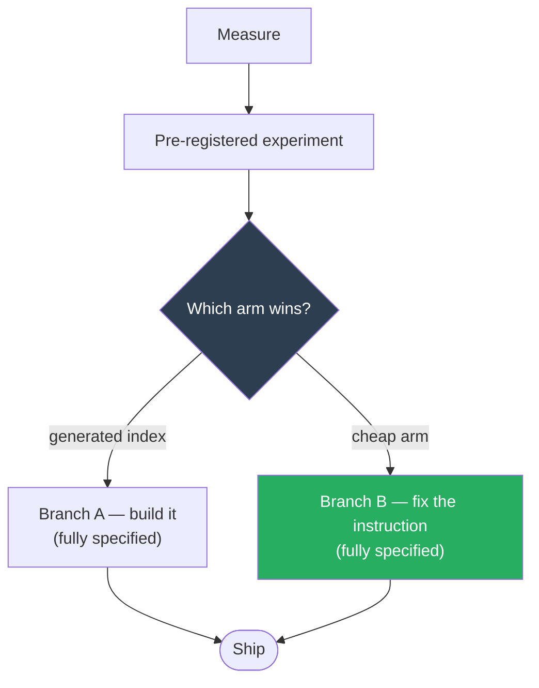

# Measure Before You Index

## TL;DR

Before building a generated knowledge index for an agent, measure three things: how many files
actually carry the metadata your generator needs, whether an index already exists that nobody reads,
and what the cheapest possible intervention buys. On one real corpus all three answers argued
against building — the generator's input didn't exist, three prior indexes sat unadopted, and a
one-line instruction change captured 54% of the win. The pattern is not "don't build an index." It is
**make the cheap option compete first, and specify both outcomes before you look.**

## Problem

Agent entry points accumulate eager context. A domain agent that reads three orientation files at boot
pays that cost on every activation, whether the question is a one-file lookup or a whole-platform
explainer.

The obvious fix — a small generated index over metadata-tagged files, with content fetched on demand —
is a good pattern with a real failure mode: **teams build the index and nothing changes.** The reason
is almost never the index. It is that some *other* instruction still tells the agent to load
everything, and instructions beat artifacts.

## Solution

### Step 1 — Measure the four numbers that decide it

| Measure | Why it decides |
|---|---|
| **Metadata coverage** — what fraction of files carry the frontmatter your generator reads | If it's 0%, your generator has no input and the "port" is actually a mass edit of every file |
| **Prior art** — does an index already exist, and does anything read it at startup? | An unadopted index is evidence about adoption, not about file size |
| **Cheapest intervention** — what does a one-line change to the boot sequence buy? | This is the bar the generator must clear, not the do-nothing baseline |
| **Corpus shape** — depth, collisions, vendored subtrees, files over your size ceiling | Reference implementations are usually written flat; real corpora are not |

### Step 2 — Read the instructions before you read the corpus

The highest-leverage finding in the real case was not in the files. It was two rules in the agent's
own configuration, sixteen lines apart:

```
Rule N   — "ALWAYS search in this order:  1. INDEX  2. GRAPH  3. ALIASES  4. grep"
Rule N+1 — "Session init, MANDATORY:      1. OVERVIEW  2. GRAPH  3. TRACKER"
                                             ↑ omits INDEX entirely, mandates eager GRAPH
```

The index was ranked first by one rule and skipped by the rule that actually fires. **It wasn't
ignored for lack of a pointer — it was overridden.** A fourth artifact would have been overridden too.

> **The generalizable form:** when an artifact isn't being used, grep the instructions before you
> improve the artifact. Adoption failures usually have an instruction upstream.

### Step 3 — Specify both branches before running the experiment



A gate with only one pre-built path is not a gate. If the expensive branch is the only thing designed,
the team defaults to it regardless of what the data says. **Write the cheap branch in the same detail
as the expensive one, and name it as a success.**

### Key components

**Arms that isolate one variable each.** Include a floor arm (search tools only, nothing eager), a
control (current behaviour unchanged), and — critically — an arm that separates *the artifact* from
*the instruction*. If the instruction-only arm wins, no artifact was ever needed.

**Two endpoints, both pre-registered.** Correctness is primary. The secondary must be **total tokens
to a correct answer**, not eager tokens. Eager tokens are a property of the arm, not a result: a
zero-eager arm can burn six figures searching blindly and a table denominated in eager tokens will
never notice.

**A pre-registered session model.** Prompt-cache reads cost a fraction of base input. One question per
fresh session makes an eager arm pay its full prefix every time; multi-turn amortizes it and collapses
the gap by roughly an order of magnitude. **That single unstated choice picks the winner.** State it,
and state which direction it biases.

**Paired analysis, not per-arm rates.** The same questions go to every arm, so analyse per-question
differences. At 20 questions, per-arm standard error is roughly ±11 points — enough to make a
rank-ordered "advance the top two" close to a coin flip when the field is tight, which is exactly when
you need the answer.

**Questions that can't be answered from a filename.** Corpora with descriptive filenames make
filename-answerable questions measure nothing. Weight to relationships: who owns X, which of two docs
is authoritative, what superseded what.

### Counter-patterns (what NOT to do)

| Anti-pattern | Why it fails |
|---|---|
| **Porting a reference implementation as "configuration"** | Reference tools are usually flat (`os.listdir`, hardcoded directory lists). A nested corpus needs real recursion, pruning, and relative-path handling. Check before you promise "zero net-new code." |
| **Auto-deriving descriptions from first sentences** | A confident wrong description routes an agent to the wrong file *silently*. A visible `TODO` routes it to search. Prefer the visible gap. |
| **Fitting your token estimator to one corpus** | And never calibrate against a different vendor's tokenizer — see below. A size-ceiling guard should over-fire, not under-fire. |
| **Excluding a directory by name because it contains generated output** | Mixed directories are common. Prune by build-system marker (`.git`, `pom.xml`, `package.json`) so vendored trees go and hand-written files stay. |
| **Naming a generated file `INDEX.md` inside subdirectories** | Hand-written ones often already exist. Use a distinct name (`_INDEX.md`) or the first run destroys them. |
| **Shipping a `<!-- GENERATED -->` freshness banner with no trigger** | A stale artifact asserting it is current is worse than one that visibly hasn't been touched. |

### The tokenizer trap — worth its own note

Every token figure in the first five drafts of the real case was produced with a tokenizer belonging
to a *different model vendor*, and labelled "real tokens." It undercounts by a meaningful margin, more
on code and tables than on prose.

The failure compounds: the same document criticized a published estimator for being 1.4× off — while
presenting a figure derived from a foreign tokenizer as ground truth. **A reviewer who catches the
first will discount the second.**

**Use the vendor's own token-counting endpoint for the model you will actually run.** The relative
comparison between arms survives a wrong tokenizer, because it is applied uniformly. The absolute
numbers do not, and absolute numbers are what end up in slides.

## When to apply this pattern

- An agent entry point loads a large fixed context on every activation
- You are considering a generated index, knowledge graph, or retrieval layer to fix it
- The corpus is **brownfield** — it exists, it's large, and it wasn't authored for your tooling
- The cost of building is measured in weeks and the cost of measuring is measured in days

## When to SKIP this pattern

- **Greenfield.** If you control the corpus from file one, require the metadata up front and skip the
  experiment — the frontmatter dilemma below never arises.
- **The corpus is small enough to load entirely.** If everything fits comfortably with room to work,
  an index is a solution to a problem you don't have.
- **You already know the boot sequence is the problem.** Then just fix it. The experiment exists to
  choose between plausible options, not to confirm an obvious one.

## The brownfield frontmatter dilemma

Worth stating separately because it inverts a common recommendation.

Co-located frontmatter is usually preferred *because* it resists drift — metadata next to content is
supposed to stay in sync. On a brownfield corpus with zero existing coverage and a no-mass-edit
constraint, the alternative is a sidecar manifest, and the standard objection is that sidecars drift.

**Both drift. Only one drift is detectable.**

```
sidecar key   = a path      → mechanically checkable against the filesystem
frontmatter   = a description → nothing can verify it still describes the file
```

The real corpus proved it: the existing hand-maintained index carried **several pointers to files that
no longer existed**, including some in the directory the configuration designated as authoritative.
Nothing in the workflow could surface them. A ten-line validator catches every one on the first run.

**On brownfield corpora the sidecar is not the compromise — it is the more verifiable option.**

## Battle-tested in

Applied to a multi-hundred-file, deeply nested knowledge corpus behind a production domain agent. The
measurement pass changed the conclusion: the planned generator was deferred behind a pre-registered
experiment, and the leading candidate became a one-line instruction fix. The design record and the
experiment itself are internal; only the method is published here.

## References

- Progressive disclosure in agent skill packaging — [Agent Skills overview](https://platform.claude.com/docs/en/agents-and-tools/agent-skills/overview)
- Token counting for the model you actually run — vendor `count_tokens` endpoints, not third-party tokenizers
- *Data Strategy for LLMs*, Chapter 11 — the three-tier knowledge-map method this pattern stress-tests
